# 🕵️‍♀️ Laporan Proyek Machine Learning - Salsabila Mahiroh

---

## 💼 Domain Proyek : Keuangan
Dalam bidang atau sektor keuangan, layanan kredit merupakan salah satu pilar utama yang menopang pertumbuhan ekonomi di dunia tetapi, tingginya angka gagal bayar (non-performing loan) dapat menimbulkan risiko serius bagi stabilitas lembaga keuangan [1]. Oleh karena itu, diperlukan sistem penilaian kelayakan kredit yang akurat untuk meminimalkan risiko tersebut.

Masalah ini harus diselesaikan karena penilaian kredit yang tidak tepat dapat menyebabkan kerugian finansial dan melemahkan kepercayaan terhadap institusi keuangan. Metode konvensional cenderung lambat, subjektif, dan kurang efektif dalam mengolah data dalam jumlah besar [5].

Sebagai solusi, pendekatan berbasis **machine learning** menawarkan kemampuan untuk memproses data historis secara efisien dan mengidentifikasi pola risiko yang kompleks. Dengan membangun dan membandingkan model prediksi seperti **K-Nearest Neighbor, Random Forest**, dan **XGBoost**, proyek ini bertujuan membantu lembaga keuangan mengambil keputusan pinjaman yang lebih tepat, mengurangi risiko gagal bayar, serta meningkatkan efisiensi dan objektivitas dalam proses seleksi kredit.

---

## 🔍 Business Understanding
### 👩🏽‍🔧 Problem Statement
1. Fitur apa saja yang paling berpengaruh terhadap status pinjaman (loan_status)?
2. Bagaimana memilih model prediksi yang paling akurat untuk memprediksi apakah seseorang mengalami gagal bayar atau tidak dengan menggunakan beberapa model seperti KNN, Random Forest, dan XGBoost?
### 👩🏽‍🏫 Goals
1. Untuk mengetahui fitur apa saja yang berpengaruh terhadap loan_status sehingga dapat mengambil keputusan selanjutnya, untuk melakukan prediksi status pinjaman berdasarkan riwayat calon peminjam.
2. Untuk melakukan analisis dan membandingkan performa beberapa model seperti KNN, Random Forest, dan XGBoost untuk memilih model dengan kinerja terbaik dalam memprediksi status pinjaman berdasarkan riwayat calon peminjam.
### 👩🏽‍💻 Solution Statements
1. Melakukan proses Exploratory Data Analysis (EDA) dengan melakukan univariate analysist, multivariate analysist, dan corellation analysist untuk melihat hubunga antar variabel guna mendapatkan insight data yang mendalam. 
2. Melakukan percobaan menggunakan model algoritma KNN, Random Forest, dan XGBoost dan melakukan evaluasi model menggunakan clasification report, confussion matrix, dan ROC-AUC untuk membandingkan dan menemukan model yang optimal dan akurat, pada kasus prediksi status pinjaman berdasarkan riwayat calon peminjam.

---

## 📁 Data Understanding
1. **Sumber dataset** : https://www.kaggle.com/datasets/laotse/credit-risk-dataset
2. **Informasi dataset** : Dataset ini merupakan dataset yang digunakan dengan metode klasifikasi biner, dataset ini digunakan untuk menganalisis risiko kredit dengan pendekatan klasifikasi.
3. **Jumlah data** : Terdapat 32.581 data dan memiliki jumlah total 12 kolom, 4 untuk kolom kategori, dan 8 untuk kolom numerik (1 sebagai kolom target)
4. **Kondisi data** :
- Terdapat missing value
- Terdapat data duplikat
- Terdapat outlier pada fitur person_age, person_income, person_emp_length, loan_amnt, loan_int_rate, loan_percent_income, cb_person_cred_hist_length

### 🔗 Variabel pada Credit Risk Dataset adalah sebagai berikut :
- **Kolom Numerik** :
1. **person_age** : Usia calon peminjam
2. **person_income** : Pendapatan tahunan calon peminjam
3. **person_emp_length** : Lama masa kerja calom peminjam (dalam tahun)
4. **loan_amnt** : Jumlah pinjaman
5. **loan_int_rate** : Suku bunga pinjaman
6. **loan_percent_income** : Presentase pinjaman terhadap pendapatan
7. **cb_person_cred_hist_length** : Durasi riwayat kredit
8. **loan_status : Status pnjaman**, 0 = Tidak gagal bayar dan 1 = gagal bayar

- **Kolom Kategori** :
1. **person_home_ownership** : Status kepemilikan tempat tinggal peminjam
2. **loan_intent** : Tujuan pinjaman
3. **loan_grade** : Tingkat pinjaman
4. **cb_person_default_on_file** : Riwayat default atau gagal bayar (YES/NO)

### 📊 Exploratory Data Analysis (EDA)
**1. EDA - Deskripsi Variabel**
Pada tahap ini EDA-deskripsi variabel digunakan untuk, memahami struktur dan karakteristik data (data understanding) yang digunakan untuk mengenali tipe data, mendeteksi nilai yang hilang atau duplikat, melihat adanya outlier, dsb. Tujuannya sebagai dasar dalam pengambilan keputusan untuk analisis selanjutnya.

**2. EDA - Univariate Analisis** 
Pada tahap ini univariate analysis digunakan untuk memahami masing-masing variabel saja. 
- **Fitur Kategorikal** :

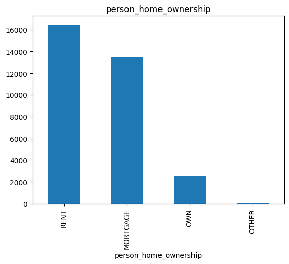
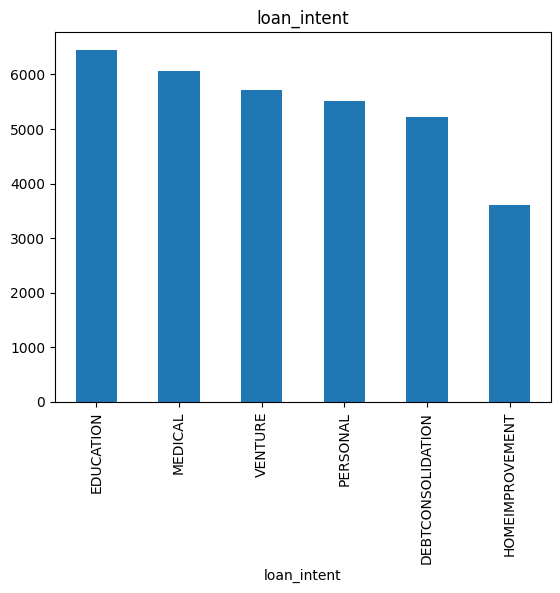
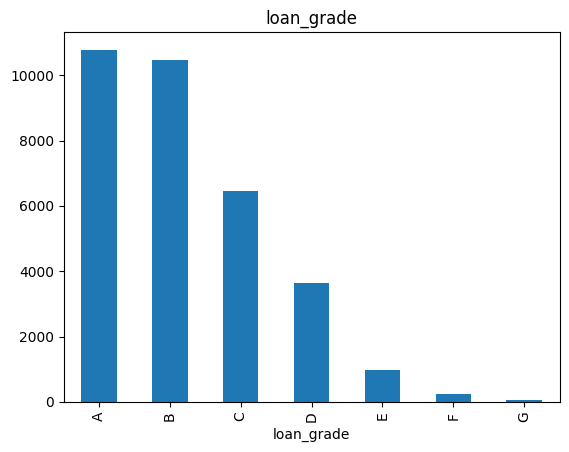
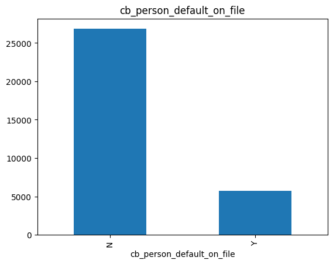

Mayoritas peminjam tinggal di tempat sewa (Rent), dengan tujuan pinjaman terbanyak untuk pendidikan (Education). Grade pinjaman paling umum adalah A, dan sebagian besar peminjam tidak memiliki riwayat gagal bayar (kategori N pada cb_person_default_on_file).
- **Fitur Numerik** :

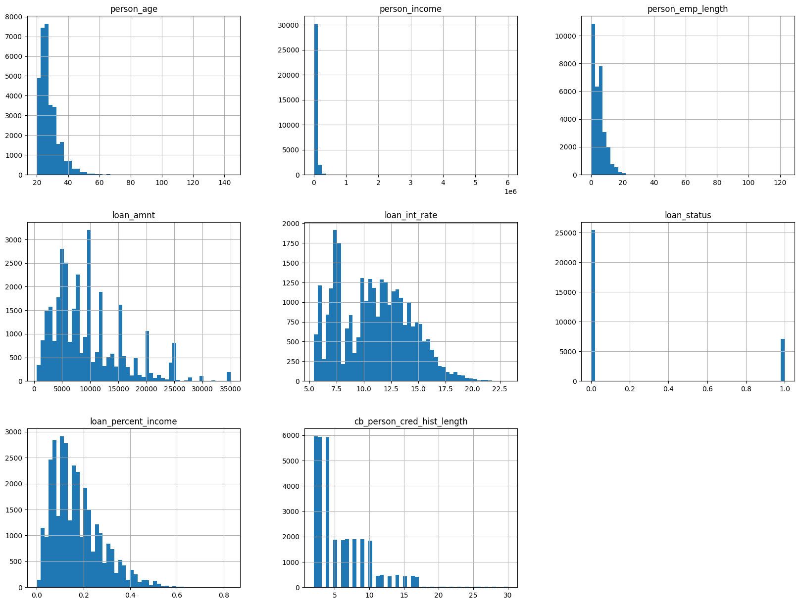

Berdasarkan distribusi fitur numerik, distribusi variabel target menunjukan ketidakseimbangan dengan mayoritas kelas 0 (tidak gagal bayar) lebih besar di bandingkan mayoritas kelas 1 (gagal bayar). Artinya, sebagian besar peminjam dalam data ini berhasil membayar pinjamannya dengan lancar, sementara hanya sebagian kecil yang mengalami gagal bayar.

**3. EDA - Multivariate Analisis**
Pada tahap ini multivariate analysis digunakan untuk eksplorasi dan memahami terhadap dua atau lebih variabel dan mengetahui hubungan antar variabel.
- **Fitur Kategorikal** :

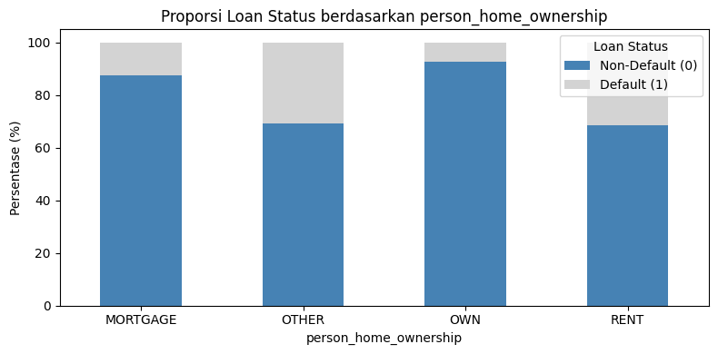
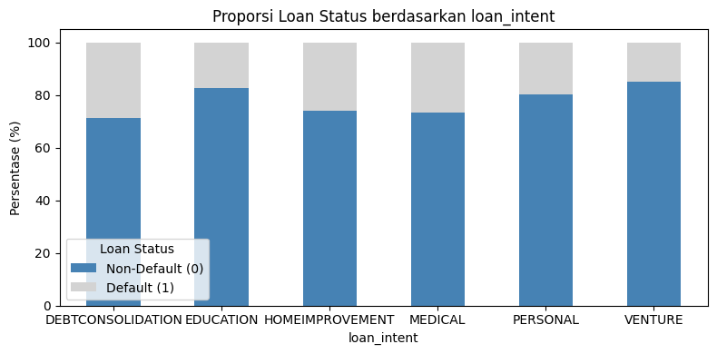
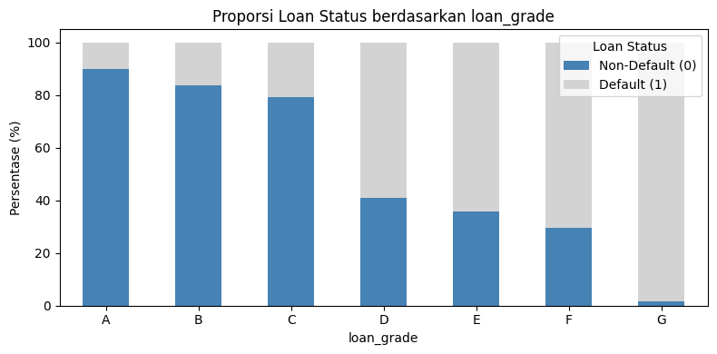
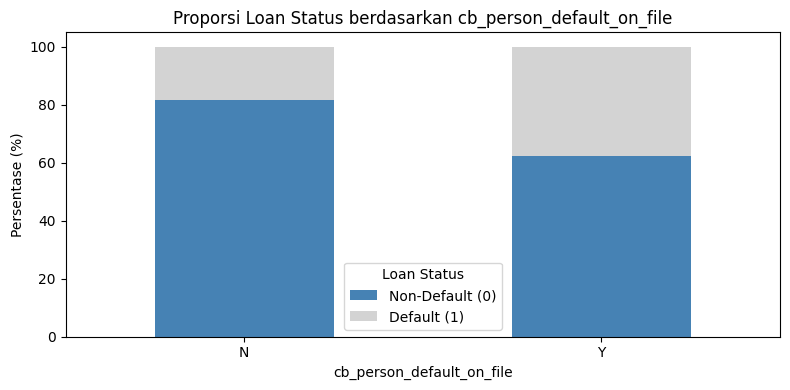

Fitur seperti person_home_ownership, loan_intent, loan_grade, dan cb_person_default_on_file memiliki pengaruh signifikan terhadap fitur target (loan_status). Risiko gagal bayar lebih tinggi pada kategori tertentu seperti sewa rumah, tujuan pinjaman untuk medis/debt consolidation, serta pada peminjam dengan grade rendah atau riwayat default sebelumnya. Hal ini menunjukkan bahwa fitur-fitur kategori berperan penting dalam menentukan status kelayakan pinjaman.
- **Fitur Numerik** :

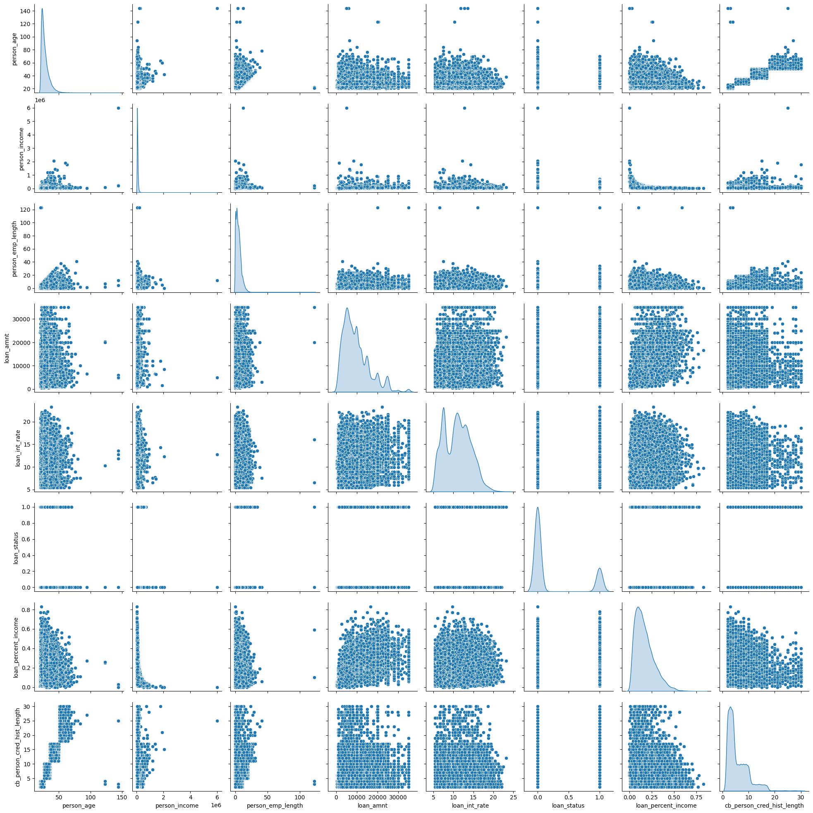

Berdasarkan visualisasi pairplot terlihat bahwa fitur loan_percent_income, loan_int_rate, dan person_income memiliki korelasi terhadap fitur loan_status. Sedangkan fitur lainnya memiliki korelasi yang lemah karena sebarannya tidak membentuk pola.

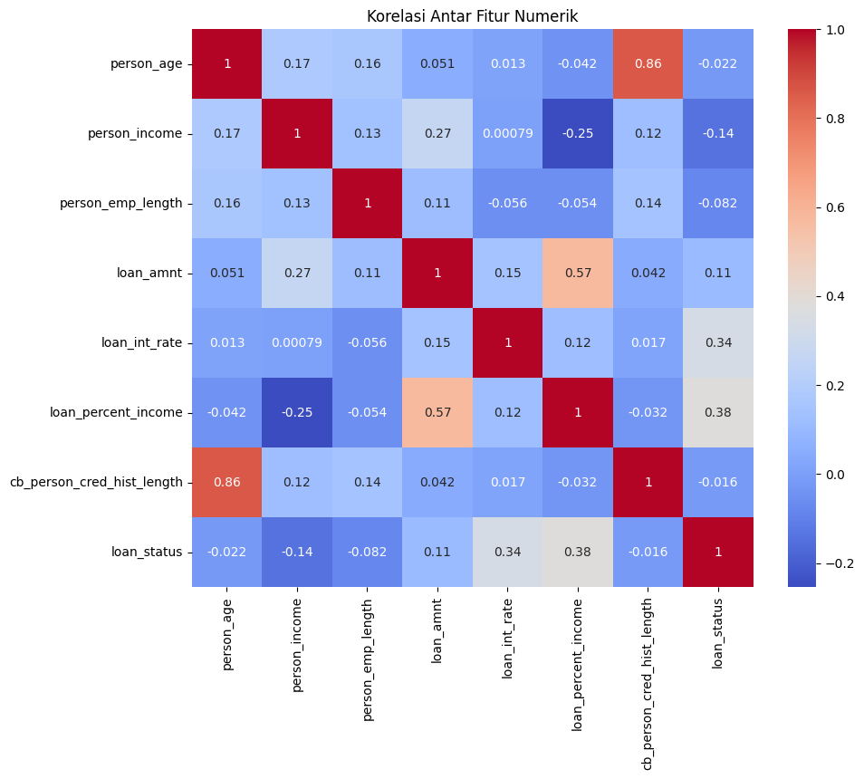

Fitur numerik dengan korelasi tertinggi terhadap loan_status adalah loan_percent_income, loan_int_rate, dan person_income :
- Korelasi antara variabel  loan_percent_income dengan loan status adalah 0.38 yang mengindikasikan memiliki korelasi yang kuat.
- Korelasi antara variabel loan_int_rate dengan loan status adalah 0.34 yang mengindikasikan memiliki korelasi yang kuat.
- Korelasi antara variabel  person_income dengan loan status adalah -0.14 yang mengindikasikan masih memiliki korelasi walaupun menunjukkan korelasi negatif.

---

## 🧮 Data Preparation
1. Menghapus kolom yang tidak memiliki korelasi dengan loan_status dengan metode drop column. Proses ini dilakukan untuk mengurangi kompleksitas data dan meningkatkan performa model, agar hanya fitur yang relevan saja yang digunakan dalam proses pelatihan.
2. Menangani missing value dengan metode imputasi. Proses ini digunakan untuk mengisi nilai kosong pada data, agar model dapat memproses semua data tanpa terganggu oleh nilai yang hilang.
3. Menangani data duplikat. Proses ini digunakan untuk menghapus entri data yang sama secara identik, agar analisis dan pelatihan model tidak bias karena pengaruh data yang berulang.
4. Menangani outlier dengan metode IQR. Proses ini digunakan untuk mengidentifikasi dan mengatasi data ekstrem di luar rentang normal, agar model tidak terdistorsi oleh nilai-nilai yang menyimpang jauh dari pola umum data.
5. Mengubah fitur kategorikal menjadi variabel numerik dengan metode One-Hot Encoding. Proses ini digunakan untuk mengonversi data kategorikal menjadi bentuk numerik yang bisa dipahami oleh algoritma machine learning, agar semua fitur dapat digunakan dalam pelatihan model tanpa kehilangan makna kategorinya.
6. Membagi data menjadi data latih dan data uji menggunakan metode train_test_split dengan porsi 80%:20%. Proses ini digunakan untuk memisahkan data yang digunakan untuk melatih model dan mengevaluasinya, agar model dapat diuji performanya pada data yang belum pernah dilihat sebelumnya.
7. Menormalisasi fitur numerik dengan StandardScaler. Proses ini digunakan untuk mengubah skala data numerik agar memiliki distribusi yang seragam (mean 0 dan standar deviasi 1), agar algoritma machine learning dapat belajar lebih efektif dan cepat, terutama untuk model yang sensitif terhadap skala fitur seperti SVM atau KNN.

---

## 💹 Modeling
1. **K-Nearest Neighbor** 
- **Cara Kerja** [3] :

a. Menentukan nilai K

b. Melakukan perhitungan nilai jarak

c. Melakukan Pengelompokkan data sesuai dengan perhitungan jarak

d. Melakukan pengurutan data sesuai dengan nilai tetangga terdekat (nearest neighbor) atau berdasarkan data yang mempunyai jarak euclidean terkecil

e. Memilih nilai mayoritas dari tetangga terdekat sebagai hasil klasifikasi.
- **Parameter yang di gunakan** :

a. n_neighbors=5 : parameter deafult yang berarti model akan mempertimbangkan 5 tetangga terdekat untuk menentukan kelas

b. Parameter lain (default) : weights='uniform', semua tetangga dianggap memiliki bobot yang sama.

c. Parameter lain (default) : algorithm='auto', algoritma pencarian tetangga dipilih otomatis oleh scikit-learn.

d. Parameter lain (default) : metric='minkowski', p=2 digunakan untuk menghitung jarak Euclidean.
- **Kekurangan dan kelebihan** :

a. Kelebihan : Mudah dipahami dan diimplementasikan, tidak memerlukan proses pelatihan.

b. kekurangan : Lambat saat prediksi pada dataset besar karena harus menghitung jarak ke semua data latih.

2. **Random Forest** 
- **Cara Kerja** :

a. Membuat banyak decision tree dari sampel data secara acak (bootstrap sampling).

b. Setiap tree melakukan klasifikasi.

c. Hasil klasifikasi diambil berdasarkan mayoritas voting dari semua pohon.
- **Parameter yang di gunakan** :

a. Dengan parameter n_estimators=100 (sebagai nilai default), berarti model menggunakan 100 pohon keputusan, lebih banyak pohon bisa meningkatkan performa tetapi juga meningkatkan waktu komputasi.

b. Parameter random_state=42  digunakan agar hasil model bersifat reproducible (konsisten setiap kali dijalankan).

c. Parameter lain (default) : criterion='gini', mengukur kualitas split berdasarkan impurity Gini.

d. Parameter lain (default) : max_depth=None, kedalaman pohon tidak dibatasi.

e. Parameter lain (default) : bootstrap=True, menggunakan teknik bootstrap untuk sampling data.
- **Kekurangan dan kelebihan** :

a. kelebihan : Akurat dan tahan terhadap overfitting karena menggabungkan banyak pohon keputusan.

b. kekurangan : Model relatif sulit diinterpretasikan karena merupakan kumpulan banyak pohon (black box).

3. **XGBoost** : 
- **Cara Kerja** :

XGBoost adalah algoritma boosting yang menggunakan prinsip gradient boosting decision tree (GBDT). Setiap pohon baru dibangun untuk mengoreksi kesalahan dari pohon sebelumnya, dengan meminimalkan fungsi loss menggunakan metode gradient descent [2].
- **Parameter yang di gunakan** :

a. Parameter use_label_encoder=False, digunakan untuk menonaktifkan encoder label bawaan (karena depreceted)

b. Parameter eval_metric='logloss',sebagai metrik evaluasi selama pelatihan.

c. Parameter random_state=42 digunakan untuk menjaga konsistensi hasil.

b. Parameter lain (default) : n_estimators=100, jumlah pohon.

c. Parameter lain (default) : learning_rate=0.3, ukuran langkah saat memperbarui bobot.

d. Parameter lain (default) : max_depth=6, kedalaman maksimal setiap pohon.

e. Parameter lain (default) : booster='gbtree', subsample=1.0, colsample_bytree=1.0
- **Kekurangan dan kelebihan** :

a. kelebihan : Performa sangat tinggi dalam prediksi dan efisien untuk dataset besar.

b. kekurangan : Lebih kompleks dan memerlukan waktu untuk tuning hyperparameter agar hasil optimal.

---

## 📋 Evaluasi
### 📈 Metrik Evaluasi 
Pada proyek ini, clasification report, confussion matrix, dan ROC-AUC digunakan sebagai metrik evaluasi untuk mengukur seberapa akurat model dalam memprediksi status peminjaman atau resiko kredit berdasarkan riwayat calon peminjam.

Penjelasan metrik evaluasi yang digunakan :
1. **Classification Report** :
- Precision : **TP/(TP+FP)**

 metrik evaluasi yang mengukur seberapa banyak prediksi yang benar di bandingkan total prediksi positif.
- Recall : **TP/(TP+FN)**

metrik evaluasi yang menggambarkan seberapa baik suatu model dalam mengidentifikasi kelas positif dengan benar.
- f1-Score : **2 * (Precision * Recall) / (Precision + Recall)**

F1-Score bekerja dengan menggabungkan precision dan recall ke dalam satu metrik untuk menilai seberapa baik model dalam mengklasifikasikan data, terutama pada kasus data yang tidak seimbang. Nilainya tinggi hanya jika precision dan recall sama-sama tinggi, sehingga memberikan gambaran seimbang antara ketepatan dan kelengkapan prediksi positif.
- Accuracy (akurasi) : **(TP + TN) / (TP + TN + FP + FN)**

Akurasi digunakan untuk data yang seimbang, jika satu kelas tidak mendominasi, maka kesalahan prediksi pada satu kelas berdampak proporsional terhadap nilai akurasi. Cara kerjanya, akurasi menghitung proporsi prediksi yang benar dibandingkan dengan total prediksi. Model membandingkan hasil prediksi dengan label asli, lalu menghitung berapa banyak yang benar, kemudian dibagi dengan jumlah seluruh data uji.

2. **Confussion matrix** : merupakan suatu metode untuk memberikan informasi hasil dari klasifikasi yang dilakukan oleh sistem yang berguna untuk menganalisis seberapa baik classifier mengenali tuple dari kelas yang berbeda [4].

3. **ROC-AUC** : metrik evaluasi yang digunakan untuk mengukur kinerja model klasifikasi, terutama dalam konteks biner (dua kelas). Metrik ini fokus pada kemampuan model untuk membedakan antara kelas positif dan negatif dengan memperhatikan trade-off antara tingkat True Positive Rate (TPR) dan tingkat False Positive Rate (FPR).

### 💡 Hasil Evaluasi Berdasarkan Metrik Evaluasi

| Model              | Accuracy | F1 Score | ROC-AUC |
| ------------------ | -------- | -------- | ------- |
| K-Nearest Neighbor | 0.893    | 0.715    | 0.871   |
| Random Forest      | 0.915    | 0.773    | 0.915   |
| XGBoost            | 0.920    | 0.787    | 0.941   |

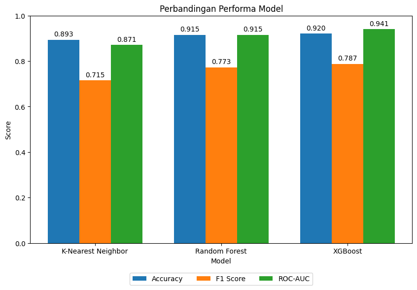

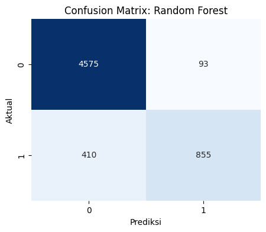
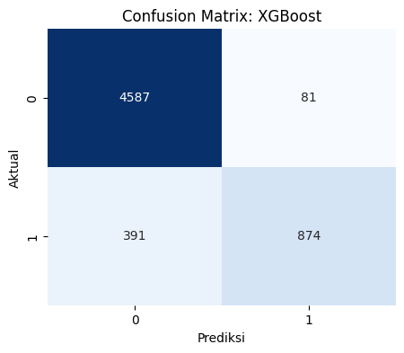

1. **K-Nearest Neighbor (KNN):**
- Berdasarkan hasil Confussion matrix : model ini cukup baik dalam mengklasifikasikan peminjam yang tidak gagal bayar, terlihat dari tingginya jumlah prediksi benar pada kelas tersebut (4509 dari total 4668). Namun, model ini masih mengalami kesulitan dalam mengidentifikasi peminjam yang gagal bayar, dengan 473 dari 1265 kasus gagal bayar diprediksi secara keliru sebagai tidak gagal bayar. Hal ini menunjukkan bahwa model cenderung bias terhadap kelas mayoritas (tidak gagal bayar), yang umum terjadi dalam dataset yang tidak seimbang.
- Berdasarkan Akurasi : Cukup tinggi, tapi bisa menyesatkan karena dataset tidak seimbang.
- Berdasarkan F1 Score : Menunjukkan bahwa model kurang seimbang dalam menangani kedua kelas.
- Berdasarkan ROC-AUC : Model cukup baik dalam membedakan antara dua kelas, meskipun performanya lebih rendah dibanding dua model lainnya.
2. **Random Forest:**
- Berdasarkan hasil confusion matrix : Model Random Forest memiliki performa yang baik dalam mengklasifikasikan peminjam yang tidak gagal bayar, terlihat dari tingginya jumlah prediksi benar, yaitu 4575 dari total 4668 kasus tidak gagal bayar. Ini menunjukkan model cukup andal dalam mendeteksi peminjam yang kemungkinan akan membayar kembali pinjamannya.Namun, model masih mengalami kesulitan dalam mengidentifikasi peminjam yang gagal bayar. Sebanyak 410 dari 1265 kasus gagal bayar diprediksi secara keliru sebagai tidak gagal bayar. Ini menunjukkan bahwa model memiliki kecenderungan bias terhadap kelas mayoritas (tidak gagal bayar).
- Berdasarkan Akurasi : Lebih tinggi dari KNN, menandakan performa keseluruhan yang lebih baik.
- Berdasarkan F1 Score : Lebih seimbang dalam mengklasifikasikan kedua kelas dibanding KNN.
- Berdasarkan ROC-AUC : Sangat baik dalam membedakan antara peminjam yang gagal dan tidak gagal bayar.
3. **XGBoost:**
- Berdasarkan hasil confusion matrix : Model XGBoost menunjukkan performa yang sangat baik dalam mengklasifikasikan peminjam yang tidak gagal bayar, dengan 4587 dari 4668 kasus diklasifikasikan dengan benar. Menunjukkan bahwa model cukup andal dalam mengidentifikasi peminjam yang bisa dipercaya untuk membayar kembali pinjamannya. Selain itu, model juga menunjukkan peningkatan dalam mengidentifikasi peminjam yang gagal bayar, yaitu dengan 874 dari 1265 kasus berhasil diklasifikasikan dengan benar. Ini sedikit lebih baik dibandingkan model Random Forest, yang hanya berhasil mengklasifikasikan 855 kasus gagal bayar.
- Berdasarkan Akurasi : Memiliki performa terbaik menunjukkan prediksi keseluruhan yang akurat
- Berdasarkan F1 Score : Menunjukkan keseimbangan yang lebih baik antara presisi dan recall.
- Berdasarkan ROC-AUC : Model sangat baik dalam membedakan dua kelas, menunjukkan performa terbaik secara keseluruhan.

### 💡 Hasil Evaluasi Berdasarkan Data Aktual 
1. **K-Nearest Neighbor (KNN)**: 1
2. **Random Forest (RF)**: 1
3. **XGBoost (Boosting)**: 1

Dalam hal ini, ketiga model dapat memprediksi dengan benar bahwa pelanggan dalam sampel ini adalah gagal membayar pinjaman.

Secara keseluruhan dari ketiga model yang telah di uji, **XGBoost** adalah algoritma yang dapat dipilih untuk melakukan suatu prediksi karena, memiliki performa tinggi yang dapat memberikan hasil yang paling akurat untuk memprediksi resiko kredit🔥.

### 💡 Hasil Evaluasi Terhadap Business Understanding
Setelah melakukan evaluasi terhadap model setiap problem statment, goals, dan solution sudah dapat menjawab dan dapat memenuhi sesuai harapan, berikut penjelasannya :
1. **Problem Statment, Goals, dan Solution 1** :
- Problem statment dapat terjawab : Fitur yang paling berpengaruh terhadap fitur target adalah person_income, person_home_ownership, loan_intent, loan_grade, loan_int_rate, loan_status, loan_percent_income, cb_person_default_on_file
- Tujuan dapat dicapai : Pemilihan fitur tersebut berhasil dilakukan, dengan melakukan tahapan Exploratory Data Analysis pada tahap multivariate analysis untuk memahami terhadap dua atau lebih variabel, sehingga dapat mengetahui fitur mana saja yang memiliki hubungan terhadap fitur target (loan_status).
- Solution statment memiliki dampak : Melakukan EDA tentunya memiliki dampak terhadap hasil prediksi karena, EDA membantu memahami pola dalam data, dan mengidentifikasi fitur-fitur yang relevan, sehingga memungkinkan pemilihan fitur yang paling informatif bagi model prediksi. 
2. **Problem Statment, Goals, dan Solution 2** :
- Problem statment dapat terjawab : Dalam memilih model, kita harus melakukan percobaan dan pengujian terlebih dahulu terhadap beberapa model yang akan digunakan kemudian, dapat membandingkan hasil performa model melalui evaluasi.
- Tujuan dapat dicapai : Tujuan untuk melakukan analisis dan membandingkan performa model telah dilakukan melalui evaluasi menggunakan confusion matrix, classification report, dan ROC-AUC. Hasil evaluasi menunjukkan bahwa model XGBoost memiliki kinerja terbaik, dengan akurasi, F1 score, dan ROC-AUC tertinggi di antara ketiganya. 
- Solution statment memiliki dampak : Dengan melakukan percobaan terhadap beberapa algoritma dan mengevaluasinya menggunakan metrik yang relevan, sehingga berhasil mengidentifikasi model terbaik secara objektif. Hal ini berdampak pada peningkatan akurasi prediksi dan efektivitas sistem dalam mengklasifikasikan status pinjaman, yang sangat penting dalam konteks manajemen risiko dan pengambilan keputusan oleh lembaga keuangan. Pendekatan ini juga menunjukkan bahwa eksperimen model dan evaluasi performa merupakan bagian penting dalam proses pengembangan solusi machine learning yang andal.

---

## 📑 Referensi
1. [Analisis perbandingan machine learning untuk prediksi kelayakan kredit perbankan pada Bank BRI Tegal](https://ejournal.uksw.edu/itexplore/article/view/14754) – IT Explore, Universitas Kristen Satya Wacana
2. [Analisis Data Menggunakan Algoritma KNN dan Naive Bayes pada Studi Kasus Kredit Macet](https://prin.or.id/index.php/JURRIMIPA/article/view/1470) – Jurnal Riset dan Rumpun Ilmu MIPA (JURRIMIPA)
3. [Penerapan Algoritma K-Nearest Neighbor (K-NN) untuk Kalsifikasi Penyakit Diabetes Melitus Studi Kasus : Warga Desa Jati Tengah](https://ejournal.unisbablitar.ac.id/index.php/antivirus/article/download/2445/1352/) – Jurnal Ilmiah Teknik Informatika
4. [PENGARUH TEKNIK OVERSAMPLING PADA ALGORITMA MACHINE LEARNING DALAM KLASIFIKASI BODY MASS INDEX (BMI)](https://journal.unesa.ac.id/index.php/jram/article/view/29199/11115) – Jurnal Riset dan Aplikasi Matematika (JRAM)
5. [Pengembangan Model Credit Risk Scoring Untuk Pembiayaan Di Lembaga Keuangan Syariah](https://repository.ptiq.ac.id/id/eprint/1575/) – Repository Institut PTIQ Jakarta

---

